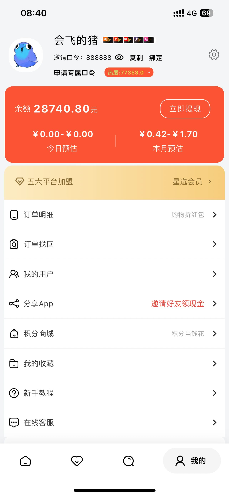
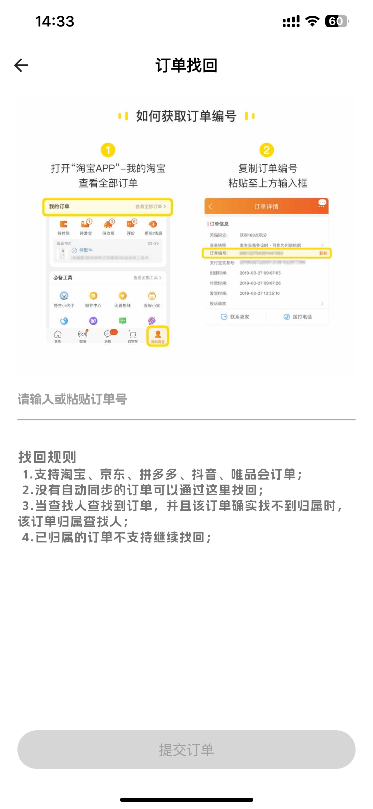
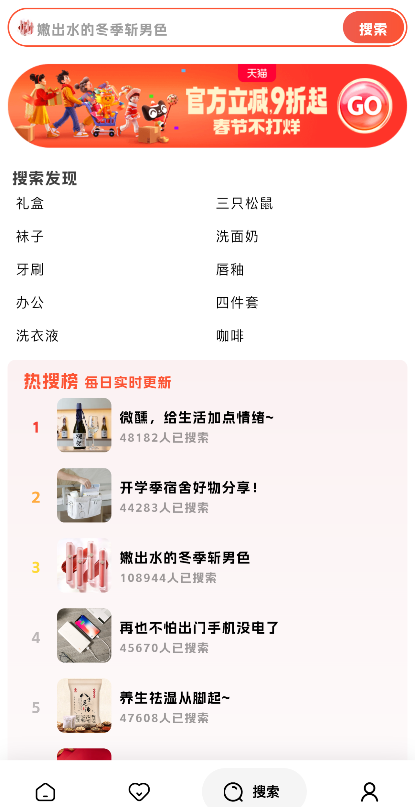
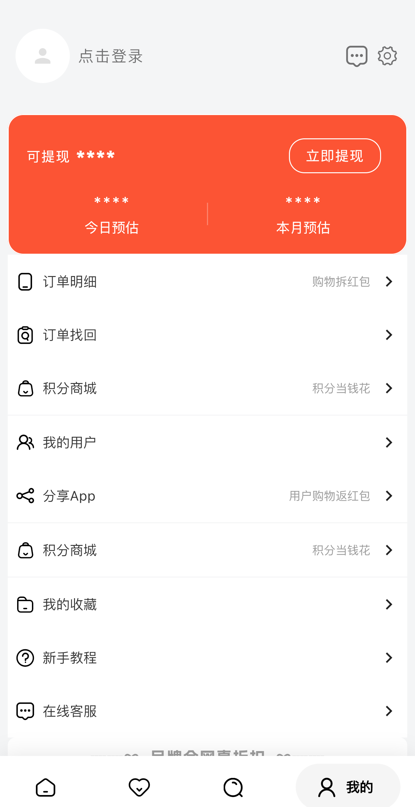
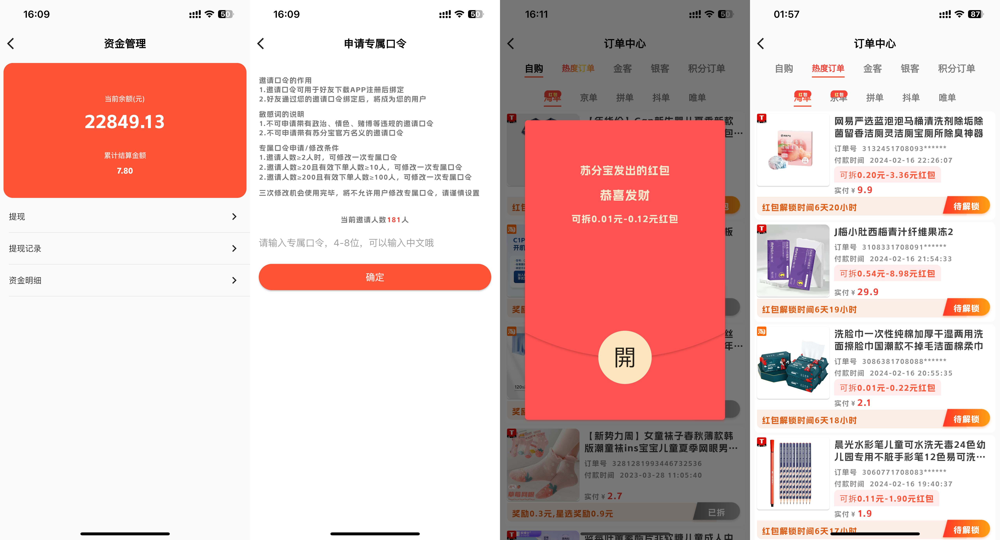

# 苏分宝开源淘宝客系统

---

### 📖 简介：

苏分宝开源淘宝客系统，基于Java（SpringBoot）+Vue+Flutter+Uniapp开发。支持App和小程序，代码二开很方便，能满足企业淘宝客等经营需求，自用、做二开项目都很合适。

---
### 🐶 源码仓库

* APP端【Flutter】：[github（查看）](https://github.com/jacky4631/sfb) [gitee（查看）](https://gitee.com/jacky4631/sfb)
* 服务端【Java + SpringBoot)】：[github（查看）](https://github.com/jacky4631/sfb_server) [gitee（查看）](https://gitee.com/jacky4631/sfb_server)
* 管理端【Vue2 + element-ui】：[github（查看）](https://github.com/jacky4631/sfb_server_admin) [gitee（查看）](https://gitee.com/jacky4631/sfb_server_admin)
* [SQL文件（获取）](https://docs-sfb.mailvor.com/docs/develop/db-get.html)

### 🎬 系统演示
[演示后台（查看）](https://docs-sfb.mailvor.com/docs/demo/demo.html)

[演示APP（查看）](https://docs-sfb.mailvor.com/docs/demo/demo.html)

---
### 💟 UI界面

#### 📱 移动端预览

    
    
    
    
    
    
    
    

---

### ⭐️ 系统功能

|  | 功能     | 描述                                                       |
|--|--------|----------------------------------------------------------|
| 🚀 | 登录     | 手机号一键登录、微信登录、手机验证码登录、苹果Apple Id登录                        |
|  | 注销用户   | 注销当前账号                                                   |
|  | 头像设置   | 可以使用相册修改头像                                               |
|  | 昵称设置   | 修改自定义昵称，支持emoj表情                                         |
|  | 绑定口令   | 绑定邀请用户的口令                                                |
| 🚀 | 申请专属口令 | 完成任务可以修改自身口令，支持中文                                        |
| 🚀 | 实名认证   | 支持身份证识别、支付宝人脸认证和合同自动签署                                   |
| 🚀 | 微信授权   | 绑定微信，实现提现自动到微信零钱、微信登录                                    |
| 🚀 | 支付宝授权  | 当前账号绑定支付宝，实现提现自动到支付宝                                     |
| 🚀 | 地址管理   | 可以设置邮寄地址，用于积分商城邮寄商品                                      |
| 🚀 | 积分商城   | 设置换购商品，购物获得积分后，可在积分商城兑换                                  |
| 🚀 | 吐槽我们   | 用户反馈建议                                                   |
|  | 隐私政策   | 支持查看用户协议、隐私政策、个人信息收集清单、个人信息共享清单等页面                       |
|  | 消息推送   | 支持订单消息推送                                                 |
| 🚀 | 收益预估   | 支持查看预估收入和订单数量，查看维度：今日、近7日、本月、上月，总览、自购、好友预估、已结算等          |
| 🚀 | 提现     | 支持微信和支付宝提现，自动到账，支持每天可提现次数、最低提现金额设置，资金明细查看，提现记录和状态查看      |
| 🚀 | 商品展示   | 支持淘宝、京东、拼多多、抖音（暂时下线）、美团含外卖、饿了么、唯品会和闲鱼商品展示                |
| 🚀 | 商品搜索   | 支持淘宝、京东、拼多多、抖音和唯品会商品搜索，关键字搜索，联想搜索，搜索历史保存，搜索结果综合、销量和价格排序  |
| 🚀 | 商品分享   | 支持淘宝、京东、拼多多、抖音和唯品会商品海报分享，部分支持口令                          |
| 🚀 | 购物返红包  | 订单打开红包获得返利                                               |
| 🚀 | 识别查券   | 支持复制链接、口令等到app查询优惠券，支持淘宝、京东、拼多多、唯品会                      |
| 🚀 | 订单明细   | 查看自购、好友（支持订单隐私设置）、积分兑换订单，查看淘宝、京东、拼多多、抖音、唯品会、美团的订单        |
| 🚀 | 订单找回   | 系统遗漏没有自动绑定到用户的订单，用户可以手动绑定                                |
| 🚀 | 我的好友   | 可以查看邀请的一二级好友，并显示最近登录时间，本月预估和好友数量                         |
| 🚀 | 分享App  | 支持海报设置，轮播展示，自动生成邀请二维码，支持微信分享app、分享链接、分享海报                |
| 🚀 | 商品收藏   | 支持商品收藏和展示并跳转购买                                           |
| 🚀 | 新手教程   | app使用教程                                                  |
| 🚀 | 在线客服   | 对接企业微信客服，方便用户咨询                                          |
| 🚀 | 会员付费   | 支持微信、支付宝、苹果内购、易宝、银盛等支付开通app会员，支持在app内使用网页支付、app支付、绑卡支付、 收银台支付 |
| 🚀 | 消息中心   | 查看用户消息、收益消息、订单消息等                                        |
| 🚀 | 积分签到   | 支持用户相关操作后奖励积分，积分可以兑换红包                                   |
| 🚀 | 自动订单采集 | QuartzJob实现的定时采集订单，支持淘宝、闪购、京东、美团、饿了么、闲鱼等                 |
| 🚀 | 商城装修   | 支持自定义页面、自定义数据、自定义魔方、自定义商品列表、自定义主题风格，可以实现千人千面             |
| 🚀 | 在线打包   | 支持在线一键打包安卓和iOS                                           |
| 🚀 | 装修模板管理 | 每个版本的app可以自定义绑定装修模板                                      |

### 💡 系统亮点：
>1.【服务端】SpringBoot 框架开发业界主流 
>2.【管理端】Vue + Element UI 
>3.【APP端】Flutter 框架,多端支持，原生体验 
>4.【小程序端】uni-app框架 

---

### 💻 开源版运行环境及框架：
~~~
移动端 Flutter3.32.7 Dart3.8.1
管理端 Vue2 + Element UI + nodejs 14
服务端 Java1.8 SpringBoot2.6.7
数据库 Mysql5.7
~~~
---

### 💻 商业版运行环境及框架：
~~~
移动端 Flutter3.32.5 Dart3.8.1
管理端 Vue3 + Element UI + nodejs 18
服务端 Java17 SpringBoot3.4.1
数据库 Mysql5.7+
小程序 uniapp
~~~
---

### 🔔 使用须知
1.允许用于个人学习、毕业设计、教学案例、公益事业、商业使用; 
2.如果商用必须保留版权信息，并支付商用授权费用，请自觉遵守; 
3.禁止将本项目的代码和资源进行任何形式的出售，产生的一切任何后果责任由侵权者自负。 

---
### ©️︎ 版权信息
本项目包含的第三方源码和二进制文件之版权信息另行标注。 
版权所有Copyright © 2018-2025 by MAILVOR 
All rights reserved。 
苏分宝 商标和著作权所有者为苏州迈沃通信有限公司。 

---
